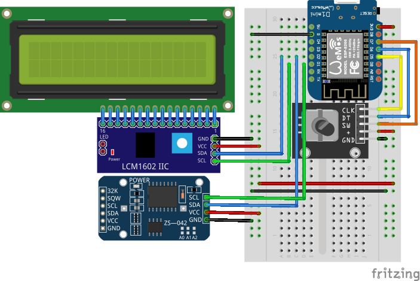

# crazyclock

[](https://github.com/The-Coobaz/crazyclock/actions/workflows/continuous-integration.yml)

The main idea of this project is arduino clock with flexible second time.
This would allow to speed up or slow down the time.

## Hardware

You are going to need:

- ESP8266 ([wemos](https://www.aliexpress.com/wholesale?SearchText=wemos+d1+mini) or [nodemcu](https://www.aliexpress.com/wholesale?SearchText=nodemcu) version)
- [1602 LCD screen with i2c converter](https://www.aliexpress.com/wholesale?SearchText=lcd+1602+i2c)
- rotary encoder, i.e. [KY-040](https://www.aliexpress.com/wholesale?SearchText=ky-040+rotary+encoder)
- real time clock, i.e. [DS3231](https://www.aliexpress.com/w/wholesale-ds3231.html)

### Schema

[](./misc/img/wemos-d1-mini.png)

## Development

### Formatting
#### VS Code

For VS Code install [Clang-Format](https://marketplace.visualstudio.com/items?itemName=xaver.clang-format) extension.

To format currently edited file use `[ctlr] + [shift] + [i]` [keyboard shortcut](https://code.visualstudio.com/docs/getstarted/keybindings#_keyboard-shortcuts-reference).

#### Console

To format all files at once (with [clang-format](https://clang.llvm.org/docs/ClangFormat.html) installed on your system):

```bash
clang-format -style=llvm -i crazyclock.ino
find src -iname "*.h" -o -iname "*.cpp" -o -iname "*.ino" | xargs clang-format -style=llvm -i
```

### Working with Arduino IDE

We keep [components in src folder](https://forum.arduino.cc/t/how-to-include-from-subfolder-of-sketch-folder/428039/9).

### Working with arduino-cli

#### Arduino CLI setup

1. [Install arduino-cli](https://arduino.github.io/arduino-cli/0.22/installation/)
2. Create configuration file: `arduino-cli config init`
3. Add esp8266 URL for board manager:

   ```
   arduino-cli config add board_manager.additional_urls https://arduino.esp8266.com/stable/package_esp8266com_index.json
   ```

4. Configure the [autocompletion for command-line](https://arduino.github.io/arduino-cli/0.22/command-line-completion/#generate-the-completion-file) (optional step)
5. Install Wemos D1 Mini board:

   ```bash
   arduino-cli core update-index
   arduino-cli core install esp8266:esp8266
   arduino-cli core list
   arduino-cli board listall esp8266:d1
   ```

#### Connecting esp-8266 (or Wemos)

1. Watch for logs with: `sudo dmesg -w | grep USB`
2. Connect your device via USB
3. Write down the ID for the USB device (i.e. _ttyUSB0_)
4. Show permissions for the device: `ls -lah /dev/ttyUSB0`
5. Write down the group of the device (i.e. _uucp_)
6. Add your user to the above group: `sudo usermod -a -G uucp $USER`
7. _logout_ and _login_ again to apply changes

#### Compile and Upload

In root directory:

1. Install required libraries (i.e. [hd44780](https://github.com/duinoWitchery/hd44780)):

   ```bash
   arduino-cli lib install "hd44780" "NTPClient" "RotaryEncoder" "Time" "Timezone" "DS3231" "Debouncer"
   ```

2. Compile: `arduino-cli --verbose compile --fqbn esp8266:esp8266:d1`
3. Upload: `arduino-cli --verbose upload --fqbn esp8266:esp8266:d1 --port /dev/ttyUSB0`

## Fritzing Parts

1. [KY-040 Rotary Encoder](https://forum.fritzing.org/t/ky-040-rotary-encoder-breakout-board-part/11073)
2. [Wemos D1 Mini](https://github.com/mcauser/Fritzing-Part-WeMos-D1-Mini/tree/master/dist)

### Automated tests

#### Requirements

1. AUnit library: `arduino-cli lib install AUnit`
2. [EpoxyDuino](https://github.com/bxparks/EpoxyDuino#installation) v1.5.0 in crazyclock `libraries` folder
3. Set environment variable `ARDUINO_CLI_DIR` for `arduino-cli` libraries:
   ```bash
   export ARDUINO_CLI_DIR=${HOME}/Arduino
   ```
4. Inside `src` folder run command `make`
