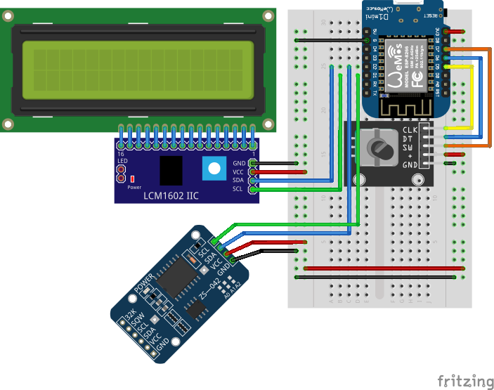

# crazyclock

The main idea of this project is arduino clock with flexible second time.
This would allow to speed up or slow down the time.

## Hardware

You are going to need:
- ESP8266 ([wemos](https://www.aliexpress.com/wholesale?SearchText=wemos+d1+mini) or [nodemcu](https://www.aliexpress.com/wholesale?SearchText=nodemcu) version) 
- [1602 LCD screen with i2c  converter](https://www.aliexpress.com/wholesale?SearchText=lcd+1602+i2c)
- rotary encoder, i.e. [KY-040](https://www.aliexpress.com/wholesale?SearchText=ky-040+rotary+encoder)

### Schema

## Development

### VS Code

#### Setup

See also instructions on the web:

- [How to Use Visual Studio Code for Arduino](https://maker.pro/arduino/tutorial/how-to-use-visual-studio-code-for-arduino)
- [Efficient Arduino Programming with Arduino CLI and Visual Studio Code](https://learn.sparkfun.com/tutorials/efficient-arduino-programming-with-arduino-cli-and-visual-studio-code/all)

#### Formatting

For VS Code with [C/C++ Extension](https://marketplace.visualstudio.com/items?itemName=ms-vscode.cpptools)
you need to update the settings to [Format Curly Braces on Same Line](https://stackoverflow.com/a/69560647/1823545):

1. Press `[ctlr] + [,]`
2. Search for `C_Cpp.clang_format_fallback`
3. Just change the value in the textfield from `Visual Studio` to `LLVM`

## Fritzing Parts

1. [KY-040 Rotary Encoder](https://forum.fritzing.org/t/ky-040-rotary-encoder-breakout-board-part/11073)
2. [Wemos D1 Mini](https://github.com/mcauser/Fritzing-Part-WeMos-D1-Mini/tree/master/dist)
